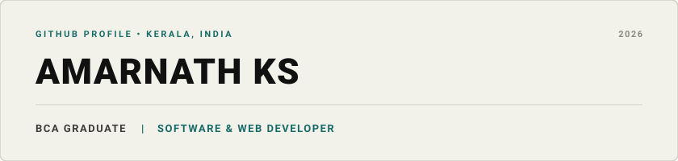

  

  <em>Recent BCA graduate focused on software and web development, with hands-on experience building responsive websites and practical web applications.</em>

  &nbsp;
  &nbsp;
  &nbsp;
  &nbsp;
  

---

### RESUME

My updated curriculum vitae detailing technical qualifications, academic background, and practical internship experience is available in PDF format:

-  **[View Resume (PDF)](Resume.pdf)**
-  **[Download Resume (PDF)](Resume.pdf)**

---

### ABOUT ME

Hi, I'm Amarnath KS, a BCA graduate and software and web developer from Kerala, India. I build responsive websites and practical web applications using technologies such as HTML, CSS, JavaScript, Python, Java and SQL.

---

### TECHNOLOGY & TOOLKIT

- **Languages:** Python, Java, C, C++, JavaScript
- **Web:** HTML5, CSS3, Responsive Web Design, Flexbox, CSS Grid
- **Database:** SQL, MySQL
- **Tools & Environments:** Git, GitHub, VS Code, Android Studio

---

### SELECTED REPOSITORIES

#### 01. NEXORA
**Premium E-commerce Website**  
*Technologies:* HTML, CSS, JavaScript  

A responsive e-commerce storefront featuring organized product catalog displays, interactive shopping cart logic, and mobile-optimized layouts. Built with pure semantic HTML, scalable CSS, and vanilla JavaScript.

- **Repository:** [github.com/amarnathks1234-ui/NEXORA.](https://github.com/amarnathks1234-ui/NEXORA.)

---

#### 02. PRAGATHI CAREER GUIDANCE
**Educational Platform**  
*Technologies:* HTML5, CSS3, JavaScript, Responsive Design  

A complete multi-page web platform designed for educational counseling, featuring structured course listings, mentorship program details, and intuitive user navigation.

- **Repository:** [github.com/amarnathks1234-ui/pragathi-](https://github.com/amarnathks1234-ui/pragathi-)
- **Live Demo:** [amarnathks1234-ui.github.io/pragathi-/](https://amarnathks1234-ui.github.io/pragathi-/)

---

#### 03. GENZ
**Modern Web Layout**  
*Technologies:* HTML5, CSS3, JavaScript  

A responsive web design project focusing on clean component architecture, modern typography hierarchy, and fluid mobile screen adaptability.

- **Repository:** [github.com/amarnathks1234-ui/GENZ](https://github.com/amarnathks1234-ui/GENZ)

---

#### 04. DEVELOPER PORTFOLIO
**Personal Portfolio & Project Showcase**  
*Technologies:* HTML5, CSS3, JavaScript  

A personal developer profile and portfolio presenting technical skills, verified academic milestones, project demonstrations, and contact channels.

- **Repository:** [github.com/amarnathks1234-ui/portfolio](https://github.com/amarnathks1234-ui/portfolio)
- **Live Demo:** [amarnathks1234-ui.github.io/portfolio/](https://amarnathks1234-ui.github.io/portfolio/)

---

### EXPERIENCE

**Web Development Intern**  
*Sapience Edu Connect* (2026)  
Worked on responsive web development tasks using HTML, CSS and JavaScript, with practical experience in website structure, interface implementation, responsive layouts and Git/GitHub workflows.

**Web Development Intern**  
*Pragathi Career Guidance* (2024)  
Assisted in the design and development of modern web pages, focusing on semantic structure, cross-device responsiveness, and clean code formatting.

---

### EDUCATION

**Bachelor of Computer Applications (BCA)**  
RR Institutions, Bangalore University  
Year of Completion: 2026  

**Microsoft Certified: Azure AI Fundamentals (AI-900)**  
Microsoft Certified Cloud and AI Fundamentals  

---

### CURRENTLY LEARNING

- Python
- Backend Development
- APIs
- Databases
- Full Stack Web Development
- Git and GitHub
- Modern Web Technologies

---

### GITHUB ACTIVITY

All projects and code updates are tracked publicly on GitHub:

- **Profile Overview:** [github.com/amarnathks1234-ui](https://github.com/amarnathks1234-ui)
- **Public Repositories:** [github.com/amarnathks1234-ui?tab=repositories](https://github.com/amarnathks1234-ui?tab=repositories)
- **Contribution History:** [github.com/amarnathks1234-ui?tab=overview](https://github.com/amarnathks1234-ui?tab=overview)

---

### LET'S CONNECT

If you would like to discuss a project, an internship role, or an entry-level software or web development opportunity, please feel free to reach out:

-  **GitHub:** [github.com/amarnathks1234-ui](https://github.com/amarnathks1234-ui)
-  **LinkedIn:** [linkedin.com/in/amarnathks2005](https://linkedin.com/in/amarnathks2005)
-  **Instagram:** [instagram.com/amarrr.cy](https://www.instagram.com/amarrr.cy?igsh=MWZycXc4ZXc4bHL1OQ==)
-  **Resume:** [View Resume (PDF)](Resume.pdf)
-  **Email:** [amarnathks1234@gmail.com](mailto:amarnathks1234@gmail.com)
- 📍 **Location:** Kerala, India